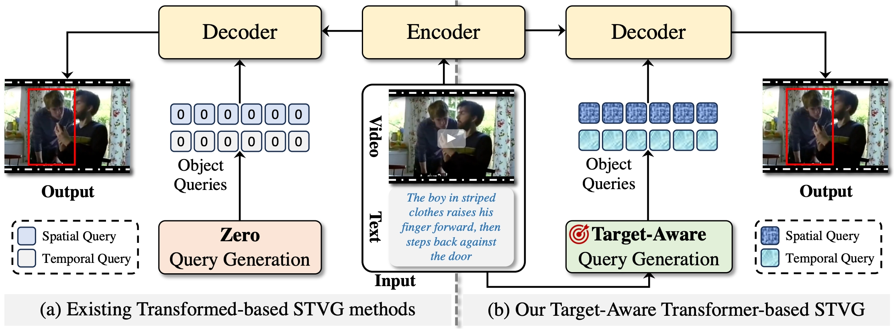
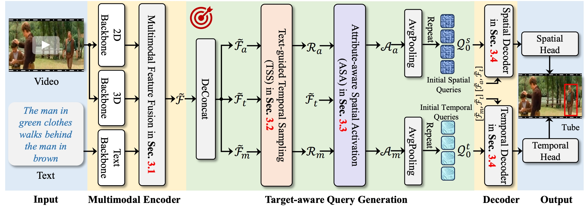

[](https://paperswithcode.com/sota/spatio-temporal-video-grounding-on-hc-stvg1)
[](https://paperswithcode.com/sota/spatio-temporal-video-grounding-on-hc-stvg2)
[](https://paperswithcode.com/sota/spatio-temporal-video-grounding-on-vidstg)

# Knowing Your Target: Target-Aware Transformer Makes Better Spatio-Temporal Video Grounding

🔮 Welcome to the official code repository of our TA-STVG. We're excited to share our work with you.

## Illustration of Idea
💡 ***In the decoder procedure, object queries expect to
learn target position information from multimodal
features. If object queries know the target from the
very beginning, or in other words, they know what
to learn, they can employ target-specific cues as a
prior to guide themselves for better interaction with
the multimodal features, which benefits learning
more discriminative features for better localization.*** <br>


**Figure:** Comparison between existing Transformer-based STVG methods applying zero-initialized
queries for STVG in (a) and our proposed Target-Aware Transformer-based STVG generating queries
with target-aware cues from video and text for STVG in (b)

## Framework

**Figure:** Overview of TA-STVG, which exploits target-specific information from the video and text (i.e., features from multimodal encoder) for generating spatial and temporal object queries for STVG. More details can be seen in the [**paper**](https://arxiv.org/abs/2502.11168).

## Implementation

### Dataset Preparation
The used datasets are placed in `data` folder with the following structure.
```
data
|_ vidstg
|  |_ videos
|  |  |_ [video name 0].mp4
|  |  |_ [video name 1].mp4
|  |  |_ ...
|  |_ annos
|  |  |_ train.json
|  |  |_ ...
|  |_ sent_annos
|  |  |_ train_annotations.json
|  |  |_ ...
|  |_ data_cache
|  |  |_ ...
|_ hc-stvg2
|  |_ v2_video
|  |  |_ [video name 0].mp4
|  |  |_ [video name 1].mp4
|  |  |_ ...
|  |_ annos
|  |  |_ train.json
|  |  |_ test.json
|  |  data_cache
|  |  |_ ...
|_ hc-stvg
|  |_ v1_video
|  |  |_ [video name 0].mp4
|  |  |_ [video name 1].mp4
|  |  |_ ...
|  |_ annos
|  |  |_ train.json
|  |  |_ test.json
|  |  data_cache
|  |  |_ ...
```

First, download the [data](https://huggingface.co/Gstar666/TASTVG/resolve/main/data.tar?download=true) file, which contains annotations for three datasets. 
Then, download the videos of the following three datasets respectively and put them into the specified path. The download link for the above-mentioned document is as follows:

**HC-STVG** ([v1_video](https://intxyz-my.sharepoint.com/:f:/g/personal/zongheng_picdataset_com/EgIzBzuHYPtItBIqIq5hNrsBBE9cnhJDWjXuorxXMhMZGQ?e=qvsBjE)), **HC-STVG2** ([v2_video](https://intxyz-my.sharepoint.com/:f:/g/personal/zongheng_picdataset_com/ErqA01jikPZKnudZe6-Za9MBe17XXAxJr9ODn65Z2qGKkw?e=7vKw1U)), **VidSTG** ([videos](https://disk.pku.edu.cn/link/AA93DEAF3BBC694E52ACC5A23A9DC3D03B))


### Model Preparation
The used datasets are placed in `model_zoo` folder

[ResNet-101](https://zenodo.org/record/4721981/files/pretrained_resnet101_checkpoint.pth?download=1), 
[VidSwin-T](https://github.com/SwinTransformer/storage/releases/download/v1.0.4/swin_tiny_patch244_window877_kinetics400_1k.pth),
[roberta-base](https://huggingface.co/FacebookAI/roberta-base)

### Requirements
The code has been tested and verified using PyTorch 2.0.1 and CUDA 11.7. However, compatibility with other versions is also likely. To install the necessary requirements, please use the commands provided below:

```shell
pip3 install -r requirements.txt
apt install ffmpeg -y
```

### Training
Please utilize the script provided below:
```shell
# run for HC-STVG
python3 -m torch.distributed.launch \
    --nnodes $WORKER_NUM \
    --node_rank $NODE_ID \
    --nproc_per_node $WORKER_GPU \
    --master_addr $WORKER_0_HOST \
    --master_port $PORT \
    scripts/train_net.py \
    --config-file "experiments/hcstvg.yaml" \
    OUTPUT_DIR output/hcstvg \
    TENSORBOARD_DIR output/hcstvg

# run for HC-STVG2
python3 -m torch.distributed.launch \
    --nnodes $WORKER_NUM \
    --node_rank $NODE_ID \
    --nproc_per_node $WORKER_GPU \
    --master_addr $WORKER_0_HOST \
    --master_port $PORT \
    scripts/train_net.py \
    --config-file "experiments/hcstvg2.yaml" \
    OUTPUT_DIR output/hcstvg2 \
    TENSORBOARD_DIR output/hcstvg2

# run for VidSTG
python3 -m torch.distributed.launch \
    --nnodes $WORKER_NUM \
    --node_rank $NODE_ID \
    --nproc_per_node $WORKER_GPU \
    --master_addr $WORKER_0_HOST \
    --master_port $PORT \
    scripts/train_net.py \
    --config-file "experiments/vidstg.yaml" \
    OUTPUT_DIR output/vidstg \
    TENSORBOARD_DIR output/vidstg
```
For additional training options, such as utilizing different hyper-parameters, please adjust the configurations as needed:
`experiments/hcstvg.yaml`, `experiments/hcstvg2.yaml` and `experiments/vidstg.yaml`. All trainings are completed on 32 A100 GPUs.

### Evaluation
Please utilize the script provided below:
```shell
# run for HC-STVG
python3 -m torch.distributed.launch \
 --nproc_per_node=8 \
 scripts/test_net.py \
 --config-file "experiments/hcstvg.yaml" \
 MODEL.WEIGHT [Pretrained Model Weights] \
 OUTPUT_DIR output/hcstvg
 
# run for HC-STVG2
python3 -m torch.distributed.launch \
 --nproc_per_node=8 \
 scripts/test_net.py \
 --config-file "experiments/hcstvg2.yaml" \
 MODEL.WEIGHT [Pretrained Model Weights] \
 OUTPUT_DIR output/hcstvg2

# run for VidSTG
python3 -m torch.distributed.launch \
 --nproc_per_node=8 \
 scripts/test_net.py \
 --config-file "experiments/vidstg.yaml" \
 MODEL.WEIGHT [Pretrained Model Weights] \
 OUTPUT_DIR output/vidstg
```

### Pretrained Model Weights
We provide our trained checkpoints for results reproducibility.

| Dataset | Resolution | Url | m_tIoU/m_vIoU/vIoU@0.3/vIoU@0.5 | Size |
|:----:|:-----:|:-----:|:-----:|:-----:|
| HC-STVG | 420 | [Model](https://huggingface.co/Gstar666/TASTVG/resolve/main/TASTVG_HCSTVG.pth?download=true)  | 53.0 / 39.1 / 63.1 / 36.8 | 1.9 GB |
| HC-STVG2 | 420 | [Model](https://huggingface.co/Gstar666/TASTVG/resolve/main/TASTVG_HCSTVG2.pth?download=true)  | 60.4 / 40.2/ 65.8 / 36.7 | 1.9 GB |
| VidSTG | 420 | [Model](https://huggingface.co/Gstar666/TASTVG/resolve/main/TASTVG_VidSTG.pth?download=true)  | 51.7 / 34.4 / 48.2 / 33.5 | 1.9 GB |


## Acknowledgement
This repo is partly based on the open-source release from [STCAT](https://github.com/jy0205/STCAT) and the evaluation metric implementation is borrowed from [TubeDETR](https://github.com/antoyang/TubeDETR) for a fair comparison.

## Citation
⭐ If you find this repository useful, please consider giving it a star and citing it:
```
@inproceedings{gu2025knowing,
  title={Knowing Your Target: Target-Aware Transformer Makes Better Spatio-Temporal Video Grounding},
  author={Gu, Xin and Shen, Yaojie and Luo, Chenxi and Luo, Tiejian and Huang, Yan and Lin, Yuewei and Fan, Heng and Zhang, Libo},
  booktitle={International Conference on Learning Representations},
  year={2025}
}
```
